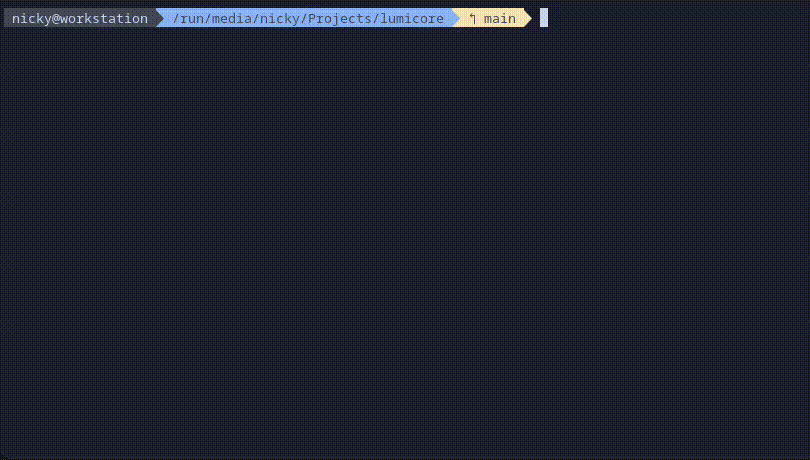
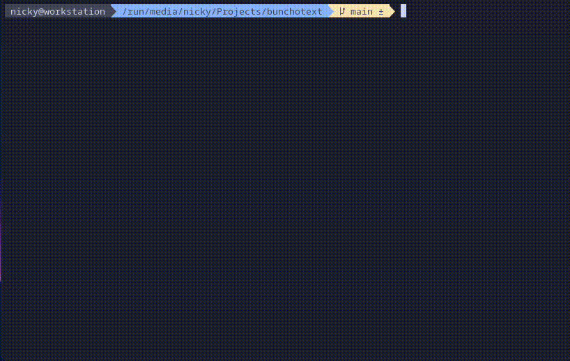

<p align="center">
  
</p>

<p align="center">
  <a href="https://go.dev/dl/"></a>
  <a href="LICENSE"></a>
  <a href="https://github.com/quadrocorp/bunchotext/graphs/contributors"></a>
  <a href="#-usage"></a>
  <a href="https://goreportcard.com/report/github.com/quadrocorp/bunchotext"></a>
</p>

---

**bunchotext** is a lightweight, high-performance CLI tool written in Go designed to concatenate source code files into a single text document. 

It is specifically optimized for preparing codebases for **Large Language Models (LLMs)**. By bundling your project files with clear separators, you can easily paste entire modules or directories into AI chat contexts for refactoring, debugging, or analysis without losing file structure context.

---

## ✨ Features

- **🚀 Fast & Lightweight:** Built in Go for quick traversal of large directories.
- **🎯 Smart Filtering:** Supports predefined file type presets (Go, Python, TypeScript, JavaScript).
- **🚫 Noise Reduction:** Automatically ignores common non-essential directories (`.git`, `node_modules`, `vendor`, etc.).
- **📝 Clear Formatting:** Each file is separated by a header indicating the file path, making it easy for humans and AI to distinguish between files.
- **🔧 Extensible:** Easy to add new file extensions or modify ignore rules in the source code.

---

## 📦 Installation

### Option 1: Pre-built Binaries (Recommended)

Download the latest pre-compiled binary for your platform from the [Releases page](https://github.com/quadrocorp/bunchotext/releases  ).

#### **Linux (amd64)**
```bash
wget https://github.com/quadrocorp/bunchotext/releases/latest/download/bunchotext-linux-amd64  
chmod +x bunchotext-linux-amd64
sudo mv bunchotext-linux-amd64 /usr/local/bin/bunchotext
```

#### **macOS**
```bash
# Intel Macs
wget https://github.com/quadrocorp/bunchotext/releases/latest/download/bunchotext-darwin-amd64  
chmod +x bunchotext-darwin-amd64
sudo mv bunchotext-darwin-amd64 /usr/local/bin/bunchotext

# Apple Silicon (M1/M2/M3)
wget https://github.com/quadrocorp/bunchotext/releases/latest/download/bunchotext-darwin-arm64  
chmod +x bunchotext-darwin-arm64
sudo mv bunchotext-darwin-arm64 /usr/local/bin/bunchotext
```

#### **Windows**

1. Download `bunchotext-windows-amd64.exe` from the [Releases page](https://github.com/quadrocorp/bunchotext/releases  )
2. Rename to `bunchotext.exe` (optional)
3. Add the folder to your system `PATH`, or run directly from the download location

---

### Option 2: Build from Source (Requires Go)

**Prerequisites:**
- [Go](https://go.dev/dl/  ) (version 1.21 or later)
- [Make](https://www.gnu.org/software/make/  ) (optional, but recommended)

#### Using Makefile (Recommended)
```bash
# Clone the repository
git clone https://github.com/quadrocorp/bunchotext.git  
cd bunchotext

# Build for your current platform
make build

# Install to ~/.local/bin
make install
```

#### Manual Build (Without Make)
```bash
# Clone the repository
git clone https://github.com/quadrocorp/bunchotext.git  
cd bunchotext

# Build for current platform
go build -o bunchotext ./cmd/bunchotext

# Move to PATH (Linux/macOS)
sudo mv bunchotext /usr/local/bin/

# Or run directly from project directory
./bunchotext
```

#### Cross-Platform Builds
```bash
# Build for all platforms (creates release artifacts)
make release

# Build for specific platform
make build-linux
make build-mac  
make build-windows
```

---

### Option 3: Go Install

```bash
go install github.com/quadrocorp/bunchotext/cmd/bunchotext@latest
```

*Note: This requires the module to be published and accessible via Go proxy.*

---

## 🚀 Usage

### Basic Command
```bash
./bunchotext -d <directory> -t <language> -o <output_file>
```

### Quick Examples
```bash
# Bundle Go files in current directory
./bunchotext -t go -o project_context.txt

# Bundle Python scripts from a specific folder
./bunchotext -d ./scripts -t py -o python_bundle.txt

# Bundle TypeScript files for AI analysis
./bunchotext -d ./src -t ts -o ai_context.txt
```

### Arguments

| Flag | Description                                           | Default           |
|------|-------------------------------------------------------|-------------------|
| `-d` | The root directory to scan for files.                 | `.` (current dir) |
| `-t` | The file type preset to use (`go`, `py`, `js`, `ts`). | `go`              |
| `-o` | The name of the output text file.                     | `output.txt`      |

### Output Format
The generated file uses a clear separator format to denote file boundaries:

```text
=========================
# internal/core/config.go
=========================
package core
...

============================
# internal/core/processor.go
============================
package core
...
```

---

## 🔤 Supported File Types

Out of the box, **bunchotext** supports the following presets:

| Preset | Extensions |
|--------|-----------|
| `go` | `.go`, `.mod`, `.sum` |
| `py` | `.py`, `.pyw`, `.ipynb` |
| `js` | `.js`, `.jsx`, `.mjs`, `.cjs`, `.json` |
| `ts` | `.ts`, `.tsx`, `.d.ts` |

> 💡 Want to add support for another language? See [Contributing](#contributing).

---

## 🛠️ Development

### Project Structure
```
bunchotext/
├── cmd/
│   └── bunchotext/
│       └── main.go          # CLI entry point
├── internal/
│   └── core/
│       ├── config.go        # File patterns & ignore rules
│       └── processor.go     # Core processing logic
├── go.mod                   # Go module definition
├── Makefile                 # Build automation
├── LICENSE                  # MIT License
└── README.md                # This file
```

### Makefile Targets
```bash
make build          # Build for current platform
make build-linux    # Build for Linux (amd64)
make build-mac      # Build for macOS (amd64 + arm64)
make build-windows  # Build for Windows (amd64)
make release        # Build all platforms for release
make install        # Build and install to ~/.local/bin
make uninstall      # Remove installed binary
make clean          # Remove build artifacts
make help           # Show available targets
```

### Running Tests
```bash
go test ./...
```

### Creating a Release
```bash
# 1. Clean previous builds
make clean

# 2. Build all platforms
make release

# 3. Verify outputs
ls -lh bunchotext-*

# 4. Create GitHub release:
#    - Go to Releases → Draft a new release
#    - Tag version (e.g., v1.0.0)
#    - Upload binaries:
#      • bunchotext-linux-amd64
#      • bunchotext-darwin-amd64
#      • bunchotext-darwin-arm64  
#      • bunchotext-windows-amd64.exe
#    - Write changelog and publish
```

---

## 🎬 Demo
### Terminal Usage

<p align="center">



</p>

<p align="center">

<em>Quickly bundle your codebase with a single command</em>

</p>
---

### Output Preview

<p align="center">



</p>

<p align="center">

<em>Clean, formatted output ready for AI analysis</em>

</p>
---

## 🗺️ Roadmap

We plan to expand **bunchotext** to make it even more flexible for developers and AI enthusiasts.

- [ ] **All-Files Mode:** A flag to bundle every text file regardless of extension.
- [ ] **JSON Configuration:** Allow users to define custom file extensions and ignore rules via a `.bunchotext.json` config file instead of recompiling.
- [ ] **Extended Presets:** Add support for Rust, C++, Ruby, PHP, and other languages.
- [ ] **Custom Formatting:** Allow users to define custom header/footer templates for bundled files.
- [ ] **Pre-configured AI Templates:** Automatically add system prompts or context headers for specific AI models.
- [ ] **Binary Releases on Homebrew/Chocolatey:** One-line installs for package managers.

---
<a id="contributing"></a>
## 🤝 Contributing

Contributions are welcome! Since file type associations are stored in simple maps within the code, adding support for a new language is straightforward.

### Adding a New Language Preset
1. Fork the repository
2. Create a feature branch: `git checkout -b feature/add-rust-support`
3. Update `internal/core/config.go`:
   ```go
   var FilePatterns = map[string][]string{
       // ... existing presets ...
       "rs": {".rs", ".toml"},  // Add your preset here
   }
   ```
4. Update the README to document the new preset
5. Submit a Pull Request

### General Contribution Guidelines
- Keep changes focused and well-documented
- Update the README if adding user-facing features

### Reporting Issues
Found a bug or have a feature request? [Open an issue](https://github.com/quadrocorp/bunchotext/issues  ) with:
- A clear description of the problem or idea
- Steps to reproduce (for bugs)
- Your OS and Go version (if relevant)

---

## 📜 License

This project is licensed under the MIT License.

```text
MIT License

Copyright (c) 2026 Tsupko Nikita "quadrocorp" Romanovich

Permission is hereby granted, free of charge, to any person obtaining a copy
of this software and associated documentation files (the "Software"), to deal
in the Software without restriction, including without limitation the rights
to use, copy, modify, merge, publish, distribute, sublicense, and/or sell
copies of the Software, and to permit persons to whom the Software is
furnished to do so, subject to the following conditions:

The above copyright notice and this permission notice shall be included in all
copies or substantial portions of the Software.

THE SOFTWARE IS PROVIDED "AS IS", WITHOUT WARRANTY OF ANY KIND, EXPRESS OR
IMPLIED, INCLUDING BUT NOT LIMITED TO THE WARRANTIES OF MERCHANTABILITY,
FITNESS FOR A PARTICULAR PURPOSE AND NONINFRINGEMENT. IN NO EVENT SHALL THE
AUTHORS OR COPYRIGHT HOLDERS BE LIABLE FOR ANY CLAIM, DAMAGES OR OTHER
LIABILITY, WHETHER IN AN ACTION OF CONTRACT, TORT OR OTHERWISE, ARISING FROM,
OUT OF OR IN CONNECTION WITH THE SOFTWARE OR THE USE OR OTHER DEALINGS IN THE
SOFTWARE.
```

---

> **Made with ❤️ for developers and AI enthusiasts**  
> [Report an issue](https://github.com/quadrocorp/bunchotext/issues  ) • [View source](https://github.com/quadrocorp/bunchotext  ) • [Releases](https://github.com/quadrocorp/bunchotext/releases  )